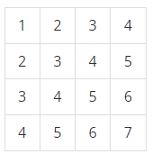

## [BOJ] 구간 합 구하기 5

### 문제
N×N개의 수가 N×N 크기의 표에 채워져 있다. (x1, y1)부터 (x2, y2)까지 합을 구하는 프로그램을 작성하시오. (x, y)는 x행 y열을 의미한다.

예를 들어, N = 4이고, 표가 아래와 같이 채워져 있는 경우를 살펴보자.



여기서 (2, 2)부터 (3, 4)까지 합을 구하면 3+4+5+4+5+6 = 27이고, (4, 4)부터 (4, 4)까지 합을 구하면 7이다.

표에 채워져 있는 수와 합을 구하는 연산이 주어졌을 때, 이를 처리하는 프로그램을 작성하시오.


### 입력정보
1. 첫째 줄에 표의 크기 N과 합을 구해야 하는 횟수 M이 주어진다. (1 ≤ N ≤ 1024, 1 ≤ M ≤ 100,000)
2. 둘째 줄부터 N개의 줄에는 표에 채워져 있는 수가 1행부터 차례대로 주어진다.
3. 다음 M개의 줄에는 네 개의 정수 x1, y1, x2, y2 가 주어지며, (x1, y1)부터 (x2, y2)의 합을 구해 출력해야 한다. 표에 채워져 있는 수는 1,000보다 작거나 같은 자연수이다. (x1 ≤ x2, y1 ≤ y2)

### 출력정보

총 M줄에 걸쳐 (x1, y1)부터 (x2, y2)까지 합을 구해 출력한다.

### 풀이방법
- 누적합 문제
1. 표의 각 칸에 대한 누적 합을 계산하여 저장한 후, 주어진 구간의 합을 누적 합을 활용하여 계산
2. 주어진 구간의 합을 계산할 때는 저장된 누적 합을 활용하여 해당 구간의 합을 빠르게 계산


### 코드설명
```
import sys

# 입력 받기
N, M = map(int, sys.stdin.readline().split())  # 표의 크기 N과 구간의 개수 M을 입력 받습니다.
table = [list(map(int, sys.stdin.readline().split())) for _ in range(N)]  # 표의 각 행을 입력 받습니다.

# 누적 합 배열 생성
prefix_sum = [[0] * (N + 1) for _ in range(N + 1)]  # 표의 크기보다 한 칸 큰 2차원 배열을 생성합니다.
for i in range(1, N + 1):
    for j in range(1, N + 1):
        # 각 칸에 대해 해당 칸까지의 부분합을 누적하여 저장합니다.
        prefix_sum[i][j] = table[i - 1][j - 1] + prefix_sum[i - 1][j] + prefix_sum[i][j - 1] - prefix_sum[i - 1][j - 1]

# 구간 합 계산 및 출력
for _ in range(M):
    x1, y1, x2, y2 = map(int, sys.stdin.readline().split())  # 구간의 시작점과 끝점을 입력 받습니다.
    # 해당 구간의 합을 누적 합을 활용하여 계산합니다.
    result = prefix_sum[x2][y2] - prefix_sum[x1 - 1][y2] - prefix_sum[x2][y1 - 1] + prefix_sum[x1 - 1][y1 - 1]
    print(result)  # 결과를 출력합니다.


```